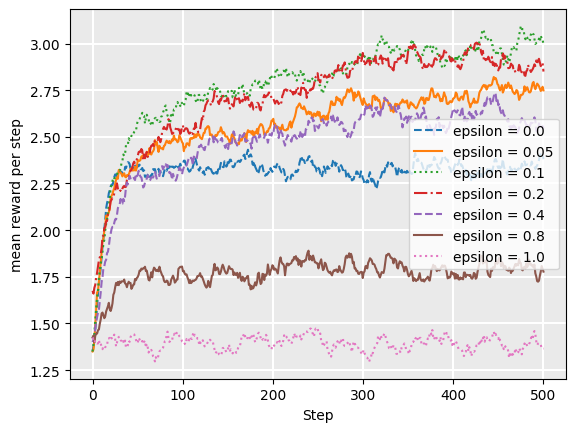
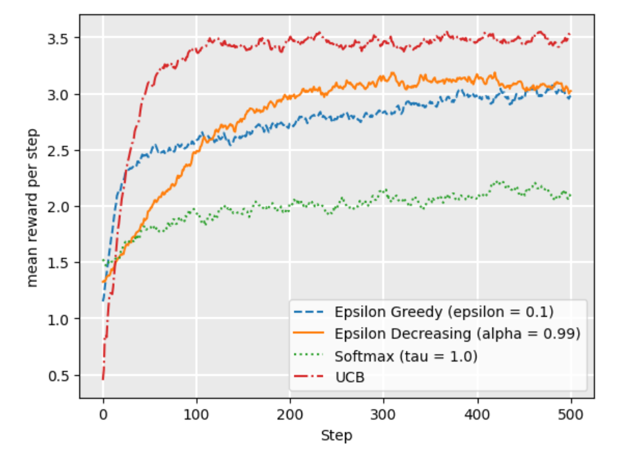

## Markov Decision Process

**The Bellman Equation**
$$
V(s) = \max_{a \in A(s)} \sum_{s' \in S} P_a(s'|s) [r(s, a, s') + \gamma V(s')]
$$
- $\gamma$ : discount factor
- $P_a(s'|s)$ : transition probability
- $r(s, a, s')$ : reward

**Policy Extraction** : DECIDING HOW TO ACT
$$
\pi(s) = \arg \max_{a \in A(s)} \sum_{s' \in S} P_a(s'|s) [r(s, a, s') + \gamma V(s')]
$$
(提取最优action)

### The multi-armed bandit problem
A mukti-armed bandit (also known as an N-armded bandit) is defined by a set of random variables $X_{i,k}$ where:
- $1 \leq i \leq N$ such that $i$ is the arm of the bandit; and 
- k the index of the play of arm $i$

The idea is that a gambler iteratively plays rounds, obervaing the reward from the arm after each round, and can adjust their strategy each time. The aim is to **maximize the sum of the rewards** collected over all rounds.

**$\epsilon$-greedy stragegy**
- With probability $1-\epsilon$ wo choose the arm with maximum Q value $\argmax_a Q(a)$
(**exploit**).
- With brobability $\epsilon$ we choose a random arm with uniform probability (**explore**)

**Softmax strategy**
$$
\frac{e^{Q(s, a) / \tau}}{\sum_{b=1}^{n} e^{Q(s, b) / \tau}}
$$
**Softmax** is a probability matching strategy, which means that the probability of each action being chosen is dependent on its Q-value so far.

**UCB1 (upper condifence bounds)**
Using the UCB1 strategy, we select the next action using the following:
$$
\argmax_a \left( Q(a)+ \sqrt{\frac{2 \ln t}{N(a)}} \right )
$$
where $t$ is the number of rounds so far, and $N(a)$ is the number of times $a$ has been chosen in all previous arounds.
- The left term encoueages exploitation: the Q-value is high for actions that have had a high reward
- The right term encourages exploration: it is high for actions that have been explored less, that is, when $N(a)$ relative to other actions. As $t$ increases, if some actions have low $N(a)$, then the expression $\sqrt{\frac{2 \ln t}{N(a)}}$ is large compared to actions with higher $N(a)$

### Temporal-difference learning
Model-free reinforcement learning is learning a policy directly from experience and rewards. Q-learning and SARSA are two model-free approaches.

$$
Q(s, a) \leftarrow Q(s, a) + \alpha [r + \gamma  V(s') - Q(s, a)]
$$
- $\alpha$: Learning rate
- $r$: Reward
- $\gamma$: discount factor

**Q-learning**

Off policy:\
$V(s') \leftarrow  \max{(Q(s', a'))}$

**SARSA**

On policy\
$V(s') \leftarrow Q^{\pi}(s', a')$

**Q-learning vs SARSA**
- Q-Learning
    - Q-learning will converge to the optimal policy
    - But it can be 'unsafe' or risky during training.
- SARSA
    - SARSA learns the safe policy, mayve not that optimal.
    - SARSA receibes a higher average reward via training.
