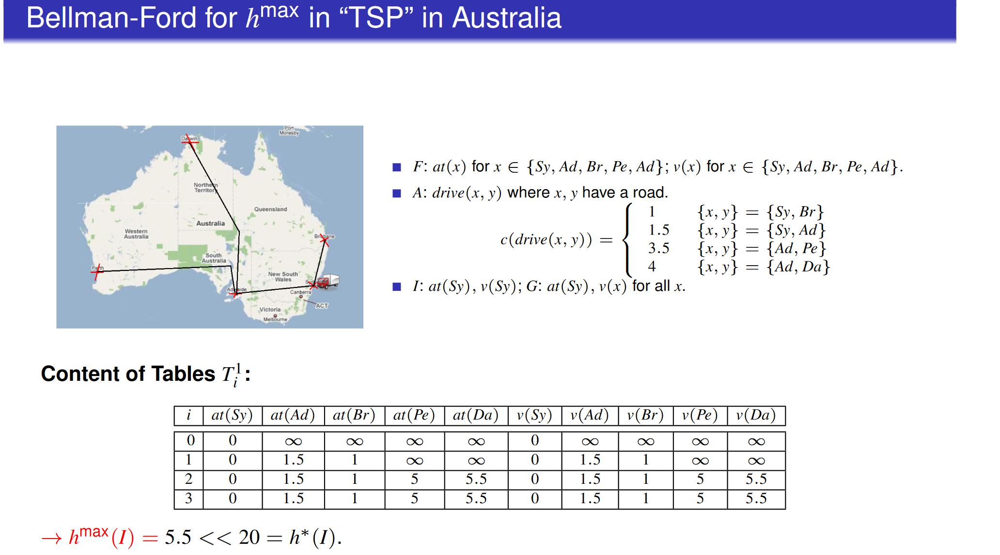
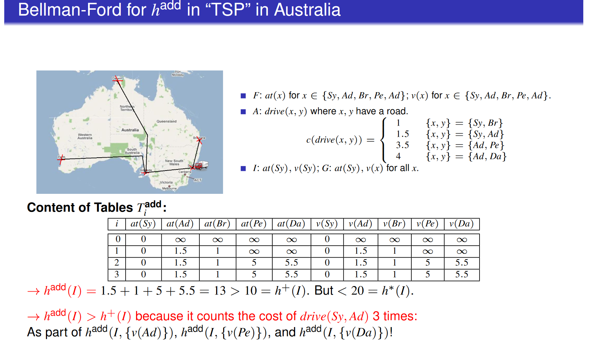

# AI Planning

## Classical Planning
**State Model $S(P)$**
- Finite and discrete state space $S$
- a known initial state  $\ s_0 \in S$
- a set $S_G \subseteq S$ of goal states
- actions $A(s) \subseteq A$ applicable in each $s \in S$
- a deterministic transition function $s' = f(a,s)$ for $a \in A(s)$
- positve action cost $c(a,s)$

Goals states can be more than one

**Search Algorithm**
- b: maximal branching factor
- d: goal depth
- m: the **maximal** depth reached

**Breadth First Search**

Stategy: FIFO (Queue)

**Depth first Search**

Strategy: Stack

|          | DFS   | BFS  | ID    | A*    | HC    | IDA*  |
|----------|-------|-------|-------|-------|-------|-------|
| Complete | No    | Yes   | Yes   | Yes   | No    | Yes   |
| Optimal  | No    | Yes*  | Yes*  | Yes   | No    | Yes   |
| Time     | $∞$  | $b^d$ | $b^d$ | $b^d$ | $∞$   | $b^d$ |
| Space    | $bd$  | $b^d$ | $bd$  | $b^d$ | $b$   | $b  d$|

A search algorithm is considered complete if it **guarantees to find a solution**, if one exists.

BFS and IDS are optimal only all nodes (edges) has equal costs(uniform).

### **Astar Search**

$f(n) = g(n) + h(n)$\
$g(n)$ : The actual cost from the initial state to the current state\
$h(n)$ : The heuristic value from the current state to goal state

$h^*(s)$ Actual optimal value from current state s to goal state 

**Property of heuristic**
1. Admissble: never over-estimate. If $h(s) \leq h^*(s)$ for all $s \in S$ 
2. Safe: for all $h(s) = \infty \rightarrow h^*(s) = \infty$
3. Goal aware： $h(s) = 0$ for all $s\in S_G$
4. Consistent: $h(s) \leq cost(a) + h(s')$ 

consistent + goal aware $\rightarrow$ admissible\
admissible $\rightarrow$ goal aware + safe

**Greedy best-first search**
- Using priority queue expand node by h(s)
- Completeness: For safe heuristic, Yes
- Optimality: No

## STRIPS And Relaxation
h+: The Optimal Delete Relaxation Heuristic

Default STRIP model: s' = s + add(s) - del(s)\
after delete relaxation: s' = s + add(s)

**Defination $h^{add}$**
$$
\begin{cases}
0 & g \subseteq s \\
\min_{a \in A, g \in \text{add}_a} c(a) + h^{\text{add}}(s, \text{pre}_a) & |g| = 1 \\
\sum_{g' \in g} h^{\text{add}}(s, \{g'\}) & |g| > 1 \\
\end{cases}
$$
如果目标大于1: $h^{add}$ 等于每个小目标的$h^{add}$ 之和

**Defination $h^{max}$**
$$
\begin{cases}
0 & g \subseteq s \\
\min_{a \in A, g \in \text{add}_a} c(a) + h^{\text{max}}(s, \text{pre}_a) & |g| = 1 \\
\max_{g' \in g} h^{\text{max}}(s, \{g'\}) & |g| > 1 \\
\end{cases}
$$

如果目标大于1: $h^{max}$ 等于每个小目标的$h^{max}$ 的最大值

$h^{add}$ 和 $h^{max}$：如果一个动作有多个precondition，则视为多个g

**Bellman-Ford Table**

$h^{max}$

$h^{add}$

- $h^{max}$ is admissible, but is typically far too optimistic

- $h^{add}$ is not admissible, but is typically a lot more informed than $h^{max}$

## Markov Decision Process

**The Bellman Equation**
$$
V(s) = \max_{a \in A(s)} \sum_{s' \in S} P_a(s'|s) [r(s, a, s') + \gamma V(s')]
$$
- $\gamma$ : discount factor
- $P_a(s'|s)$ : transition probability
- $r(s, a, s')$ : reward

**Policy Extraction** : DECIDING HOW TO ACT
$$
\pi(s) = \arg \max_{a \in A(s)} \sum_{s' \in S} P_a(s'|s) [r(s, a, s') + \gamma V(s')]
$$
(提取最优action)

### Reinforcement Learning

$$
Q(s, a) \leftarrow Q(s, a) + \alpha [r + \gamma  V(s') - Q(s, a)]
$$
- $\alpha$: Learning rate
- $r$: Reward
- $\gamma$: discount factor

**Q-learning**

Off policy:\
$V(s') \leftarrow  \max{(Q(s', a'))}$

**SARSA**

On policy\
$V(s') \leftarrow Q^{\pi}(s', a')$

**Q-learning vs SARSA**
- Q-Learning
    - Q-learning will converge to the optimal policy
    - But it can be 'unsafe' or risky during training.
- SARSA
    - SARSA learns the safe policy, mayve not that optimal.
    - SARSA receibes a higher average reward via training.