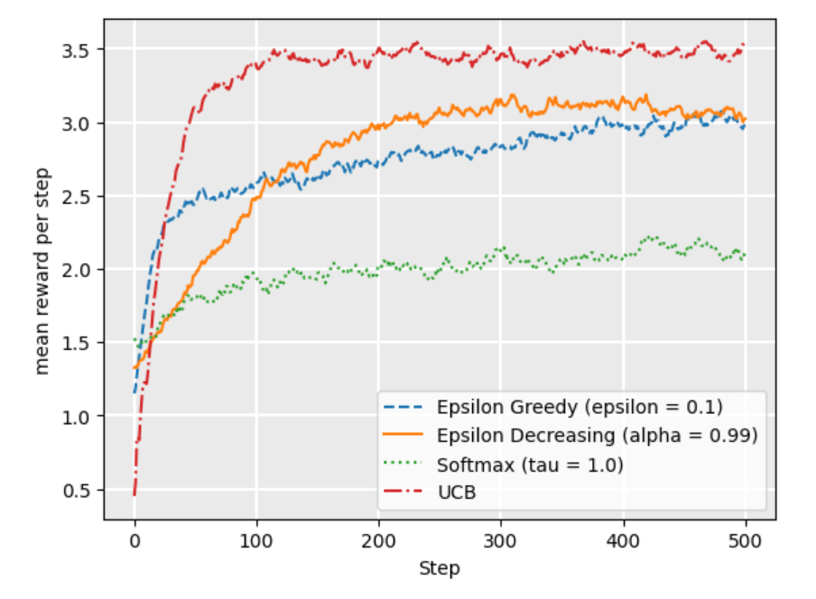

# AI Planning

## Classical Planning
**State Model $S(P)$**
- Finite and discrete state space $S$
- a known initial state  $\ s_0 \in S$
- a set $S_G \subseteq S$ of goal states
- actions $A(s) \subseteq A$ applicable in each $s \in S$
- a deterministic transition function $s' = f(a,s)$ for $a \in A(s)$
- positve action cost $c(a,s)$

Goals states can be more than one

**Search Algorithm**
- b: maximal branching factor
- d: goal depth
- m: the **maximal** depth reached

**Breadth First Search**
Data structure: FIFO (Queue)

*Breadth First Search* explores node level by level, and a queue (FIFO) allows nodes to be processed in the order that they are discovered, which ensures all nodes at a given depth are expanded before moving to the next level.


**Depth first Search**

Data structure: LIFO (Stack)

*Depth FiRst Search* explores as deep as possible along each branch before backtracking, and a stack (LIFO) enables this by always processing the most recently discovered node that still has unexplored successors.


**Uniform Cost Search**

Data structure: Priority Queue

*Uniform Cost Search* expands nodes based on t6he lowest cumulaitve cost, and a priority queue efficiently retrieves the node with the minimal cost at each step, allowing UCS for finding the optimal path.


|          | DFS   | BFS  | ID    | A*    | HC    | IDA*  |
|----------|-------|-------|-------|-------|-------|-------|
| Complete | No    | Yes   | Yes   | Yes   | No    | Yes   |
| Optimal  | No    | Yes*  | Yes*  | Yes   | No    | Yes   |
| Time     | $∞$  | $b^d$ | $b^d$ | $b^d$ | $∞$   | $b^d$ |
| Space    | $bd$  | $b^d$ | $bd$  | $b^d$ | $b$   | $b  d$|

A search algorithm is considered complete if it **guarantees to find a solution**, if one exists.

BFS and IDS are optimal only all nodes (edges) has equal costs(uniform).

### **Astar Search**

$f(n) = g(n) + h(n)$\
$g(n)$ : The actual cost from the initial state to the current state\
$h(n)$ : The heuristic value from the current state to goal state

$h^*(s)$ Actual optimal value from current state s to goal state 

**Property of heuristic**
1. Admissble: never over-estimate. If $h(s) \leq h^*(s)$ for all $s \in S$ 
2. Safe: for all $h(s) = \infty \rightarrow h^*(s) = \infty$
3. Goal aware： $h(s) = 0$ for all $s\in S_G$
4. Consistent: $h(s) \leq cost(a) + h(s')$ 

consistent + goal aware $\rightarrow$ admissible\
admissible $\rightarrow$ goal aware + safe

**Optimality for A star search**
- A star search without **re-open mechanism** requires both **consistent** and **admissible** to ensure finding an optimal path.
- With re-open mechanism, it only requies admissible

Example for a non-optimal solution by inconsistent but adimissble for A* search without re-open nodes.
```
     (8)
      A
     / \
+1  /   \ +3
   /     \   
  B ----- C ----- D
(7)  +1  (0)  +6  (0)
```
[Reference: Why does A* with admissible non consistent heuristic find non optimal solution?](https://stackoverflow.com/questions/51684682/why-does-a-with-admissible-non-consistent-heuristic-find-non-optimal-solution)

**Greedy best-first search**
- Using priority queue expand node by h(s)
- Completeness: For safe heuristic, Yes
- Optimality: No

## STRIPS And Relaxation
h+: The Optimal Delete Relaxation Heuristic

Default STRIP model: s' = s + add(s) - del(s)\
after delete relaxation: s' = s + add(s)


**Defination $h^{add}$**
$$
\begin{cases}
0 & g \subseteq s \\
\min_{a \in A, g \in \text{add}_a} c(a) + h^{\text{add}}(s, \text{pre}_a) & |g| = 1 \\
\sum_{g' \in g} h^{\text{add}}(s, \{g'\}) & |g| > 1 \\
\end{cases}
$$
如果目标大于1: $h^{add}$ 等于每个小目标的$h^{add}$ 之和

**Defination $h^{max}$**
$$
\begin{cases}
0 & g \subseteq s \\
\min_{a \in A, g \in \text{add}_a} c(a) + h^{\text{max}}(s, \text{pre}_a) & |g| = 1 \\
\max_{g' \in g} h^{\text{max}}(s, \{g'\}) & |g| > 1 \\
\end{cases}
$$

如果目标大于1: $h^{max}$ 等于每个小目标的$h^{max}$ 的最大值

<span style="color: orange;">

$h^{add}$ 和 $h^{max}$：如果一个动作有多个precondition，则视为多个g

</span>


**Bellman-Ford Table**

$h^{max}$


$h^{add}$


- $h^{max}$ is admissible, but is typically far too optimistic

- $h^{add}$ is not admissible, but is typically a lot more informed than $h^{max}$

**Relaxed Plan Extraction $h^{ff}$**

$\text{Open} := G \setminus s, \quad \text{Closed} := \emptyset, \quad \text{RPlan} := \emptyset$

$\textbf{while} \; \text{Open} \neq \emptyset \; \textbf{do}$

$\quad \text{select } g \in \text{Open}$

$\quad \text{Open} := \text{Open} \setminus \{g\}, \quad \text{Closed} := \text{Closed} \cup \{g\}$

$\quad \text{RPlan} := \text{RPlan} \cup \{ b_s(g) \} ; \text{Open} := \text{Open} \cup \left( \text{pre}_{b_s(g)} \setminus (s \cup \text{Closed}) \right)
$

$\textbf{return } \text{RPlan}$


## Markov Decision Process

**The Bellman Equation**
$$
V(s) = \max_{a \in A(s)} \sum_{s' \in S} P_a(s'|s) [r(s, a, s') + \gamma V(s')]
$$
- $\gamma$ : discount factor
- $P_a(s'|s)$ : transition probability
- $r(s, a, s')$ : reward

**Policy Extraction** : DECIDING HOW TO ACT
$$
\pi(s) = \arg \max_{a \in A(s)} \sum_{s' \in S} P_a(s'|s) [r(s, a, s') + \gamma V(s')]
$$
(提取最优action)

### The multi-armed bandit problem
A mukti-armed bandit (also known as an N-armded bandit) is defined by a set of random variables $X_{i,k}$ where:
- $1 \leq i \leq N$ such that $i$ is the arm of the bandit; and 
- k the index of the play of arm $i$

The idea is that a gambler iteratively plays rounds, obervaing the reward from the arm after each round, and can adjust their strategy each time. The aim is to **maximize the sum of the rewards** collected over all rounds.

**$\epsilon$-greedy stragegy**
- With probability $1-\epsilon$ wo choose the arm with maximum Q value $\argmax_a Q(a)$
(**exploit**).
- With brobability $\epsilon$ we choose a random arm with uniform probability (**explore**)


**Softmax strategy**
$$
\frac{e^{Q(s, a) / \tau}}{\sum_{b=1}^{n} e^{Q(s, b) / \tau}}
$$
**Softmax** is a probability matching strategy, which means that the probability of each action being chosen is dependent on its Q-value so far.

**UCB1 (upper condifence bounds)**
Using the UCB1 strategy, we select the next action using the following:
$$
\argmax_a \left( Q(a)+ \sqrt{\frac{2 \ln t}{N(a)}} \right )
$$
where $t$ is the number of rounds so far, and $N(a)$ is the number of times $a$ has been chosen in all previous arounds.
- The left term encoueages exploitation: the Q-value is high for actions that have had a high reward
- The right term encourages exploration: it is high for actions that have been explored less, that is, when $N(a)$ relative to other actions. As $t$ increases, if some actions have low $N(a)$, then the expression $\sqrt{\frac{2 \ln t}{N(a)}}$ is large compared to actions with higher $N(a)$



### Temporal-difference learning
Model-free reinforcement learning is learning a policy directly from experience and rewards. Q-learning and SARSA are two model-free approaches.


$$
Q(s, a) \leftarrow Q(s, a) + \alpha [r + \gamma  V(s') - Q(s, a)]
$$
- $\alpha$: Learning rate
- $r$: Reward
- $\gamma$: discount factor


**Q-learning**

Off policy:\
$V(s') \leftarrow  \max{(Q(s', a'))}$

**SARSA**

On policy\
$V(s') \leftarrow Q^{\pi}(s', a')$

**Q-learning vs SARSA**
- Q-Learning
    - Q-learning will converge to the optimal policy
    - But it can be 'unsafe' or risky during training.
- SARSA
    - SARSA learns the safe policy, mayve not that optimal.
    - SARSA receibes a higher average reward via training.
