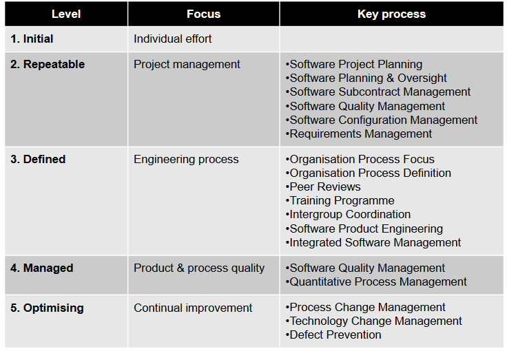

## Agile SDLC

### **Agile manifesto**
Individuals & interactions over process and tools.
Working software over comprehensive documentation.
Customer collaboration over contract negotiation.
Responding to change over following the plan.

**Scrum** \
Scrum is a lightweight framework that helps teams and organizations generate value and is based on transparency, inspection and adapatition.

### **Scrum team/ Accountabilities**

**Scrum Master**: (促进团队合作, 沟通, 减少障碍): Fostering Communication, Agile Coaching, Protecting the Team, Team support, Remove obscale

**Product Owner** (manage requirement, manage product backlog, adjuct priority, decide what can be deliverable) Terminating a sprint, Participating in daily scrums,Managing product backlog, Anticipating client needs

**Dev Team**: Self organization, Cross functional,Estimates possible release date of features

**Other Agile frameworkds**

**Kanban**: Visualising work,
Limiting work progress,
Maximising effciency,
Focous on reducing the time taken to take a project to finish

**eXtremre Programing**: Frequencet releases in short development cycles
,Intended to improve productivity and introduce checkpoints
,**Pair programming**

## Project Schdule

Project Schedule is used and maintained throughout the project to monitor and track project progress – it is a living document.

Project schedule contain 1. Duration and dependencies for each task 2. People and physical resources required by each task 3. Milestones and deliverables 4. Project Timeline 

**Waterfall (Predictive) Process**
- **Constraint**: scope (requirement). They are usually defined and fixed at the start of the project
- **Plan driven** This process is plan-driven, meaning that a detailed plan is made at the beginninng of the project.
- **Estimates**: The plan creates estimates for the cost and time required to complete the project based on the *fixed scope*

**Agile(Adaptive) Process**
- **Constraint**: In agile, the constraints are **Cost and time**
- **Value/Vision**: The focus is on delivering the most valuable features according to the business needs, rather than a pre-defined set of requirements.
- **Estimates** Agile work within fixed time and cost, with the scope being adjusted based on what can be delivered in that time.

**Key Comparison**
- **Water fall** The scope is fixed, cost and time estimates are derived from that fixed scope
- **Agile** Time and cost are fixed, while the scope is flexible and can be adjusted based on value delivered.

**Examples of Task Dependencies**

-  Finish-to-Start: Predecessor must finish before Successor can start
- Start-to-Start: Predecessor must start before Successor can start
- Finish-to-Finish: Predecessor must finish before the Successor can Finish
- Start-to-Finish: Predecessor must start before the Successor can finish

## Outsouring/Procurement/Contracts
**Outsouring :** The practice of engaging an external party (under contract) to perform services or create goods that are traditionally performed in-house by the company's own employees.

- Onshoring: Relocating activities inside national borders to access targeted benefits. (Sydney - Brisbane)
- Nearshoring: Activities relocated to another country with close proximity e.g. New Zealand, Indonesia.
- Offshoring: Activities relocated to another country irrelevant of geographical location and time zones.

**Procurement** buy (outsource) any products or services from outside the organisation

**Procurement Management Process - Stages** Planning Source Manage

**Planning** in procurement involves: 1.**consulting key stakeholders** to define the ‘real’ need 2.**analyzing how the supply market works** 3.**assessing risks** 4.**defining the best procurement strategy** to meet organizational requirements    

**Source** 1. Identify and engage suppliers who will provide the best value for money outcome, in a framework of probity and fair dealing. 2. A key deliverable for this stage is to determine the appropriate sourcing method, with consideration given to alternatives other than just tendering.

**Manage** Every arrangement articulates the rights and responsibilities of the parties so it is important to identify, understand and manage them in order to better ensure you ‘get what we contracted for’. Signing an arrangement is not the end of a process, but rather the start of an on-going relationship with the supplier. It needs to be managed in order to deliver the best outcome for the organisation.

Contracts:
Fixed Price contracts: involve a fixed total price for a well-defined product or service.

Time & Material contracts: involve payment to the seller for actual time spent and any materials used in providing the service.
## Quality Management (week 6)
**Cost of Software Quality Management**:

**Conformance** : Delivering products that meet requirements and are fit for purpose.
**Nonconformance** :Refers to taking responsibility for failures or not meeting quality expectation

**Quality Management Processes**: 1. PerformingQuality Assurance 2. Quality Control 3. Performing Quality Control

**Quality Assurance** Verification and Validation

**Verification**: Ensuring you are building the system right (the right way).\
**Validation**: Ensuring that you are building the right system (to meet stakeholder needs).

Quality Assurance –Types of Testing

**Unit Test**: Used to test each individual component (often a program) to ensure it is defect-free. Performed before **commencing integration testing**.

**Integration Testing**: Between unit testing and system testing, esures that subset(s) of the overall system work together correctly.

**System Testing**: Tests the entire system as one entity. Ensures that the entire system is working correctly.

**User Acceptance Testing**: Testing performed by end users prior to accepting the delivered system.

**Quality Assurance -Software Standards and Systems**

Advantages of standards
- Provide a framework around which the quality assurance process may be implemented.
-Customers sometimes require a particular quality standard/level when choosing a software vendor.

Disadvantages of standards
- Involve too much bureaucratic form filling.

**Quality Assurance -Capability Maturity Model Integration (CMMI)**
Describes an approach for software companies to move from an ad-hoc, immature process to a mature developed process.Organizations are characterised being at a Level from 1-5 based on the processes they follow.

|  |  |
|:--------------------------:|:--------------------------:|

**Quality planning**

Incorporating quality standards into project design

Product Overview  Product Plan  Quality Goals  Process Description Document and Coding Standards Risks and Risk Management

**Quality Control and Monitoring**

Involves monitoring the software development process to ensure that the quality assurance procedures and standards specified in the Software Quality Plan are being followed.

**Three common types** of reviews (there are also other types of reviews): 1. Technical Reviews 2. Business Reviews 3. Management Reviews

**Technical Reviews**
Reviews of artefacts is performed by peers in the development team but the author/s are involved.

**Business Reviews**
The goal of a business review is to ensure that the IT solution provides the functionality specified in the project scope and requirements document.

**Management Reviews**
Compares the project’s actual progress against a baseline project plan. **Project Manager** is responsible for presenting the project progress and providing a clear picture of the current status. May involve reviewing if the project meets the scope, schedule, budget and quality objectives.

**Agile Centric Software Quality Management**

**Test Driven Development (TDD)**
1. You are not allowed to write any production code unless it is to make a failing unit test pass.
2. You are not allowed to write any more of a unit test than is sufficient to fail; and compilation failures are failures.
3. You are not allowed to write any more production code than is sufficient to pass the one failing unit test.

**Acceptance-Test Driven Development QA Practices**

**Stakeholders** are first engaged to collaboratively discusses acceptance criteria, with stakeholders and team members providing input on what to test before any code is written.

Tests are then written to evaluate these specifications, and only then writing the actual code to implement that feature.

**Behavior-Test Driven Development QA Practices**

It focuses on defining the behavior of software through conversation and concrete examples and writing specifications in clear and plain language.

**CI / CD**
meets the first principle of the Agile Manifesto: “Our highest priority is to satisfy the customer through early and continuous delivery of valuable software”.

Continuous integration requires that every time somebody commits any change, the entire application is built and a comprehensive set of automated tests is run against it.

## Risk analysis(week 3)
**Risk Analysis - Qualitative** 
risk probability (P)  risk impact (I)
$$
\text{Risk exposure} = P \times I
$$

**Risk Assessment - Quantitative** Quantitative approaches include **mathematical and statistical techniques**

**Risk Management In Agile**
**Plan**: Risk Registers can be documented in a **Risk Register**

**Identify**: Risk assessment workshops conducted by Product Owner to identify areas. Risks are added as **user stories** and **prioritized in Product Backlog**

**Analyse and Assess (Qualitative and Quantitative)**: 
Team members analyses/assess and plan these risks during sprint planning. They can add new risks as they discover

**Respond (Action)**: Mitigation strategies defined for risk items and completed within sprint. 

**Monitor and Control**: Product Owners receive regular updates on risk register. Scrum master monitors risks in daily stand ups

## Configuration Management (Week 8)
**A Software Configuration is**: 1. The total of all the artefacts. 2. The current state of all the artefacts 3. The dependencies between all the artefacts.

**The aim of configuration management** is to manage change properly without losing overall consistency through: 1. Establishing processes 2. Setting up repositories 3. Using other appropriate tools and techniques 

### CM(Configuration Management)
Configuration Management aims: 1. To identidy all items that collectively will make up the configuration. 2. To manage changes to one or more of these items so that the collection remains consistent. 3. To manage different verisons of the product. 4. To assure software quality as the configuration evolves over time.

## PMP/Stakeholder/Teams/Communication Management (week 4)

|  |  |
|:--------------------------:|:--------------------------:|
| **Types of Stakeholder** | **Power/Interest Grid** |

**Levels of Stakeholder Engagement**
- **Unaware**: Unaware of the project and its potential impacts on them
- **Resistant**: Aware of the project yet resistant to change
- **Neutral**: Aware of the project yet neither supportive nor resistant
- **Supportive**: Aware of the project and supportive of change
- **Champion / Leading**: Aware of the project and drives change

**Power/Interest Grid**

**Conway’s Law**: Organizations which design systems [...] are constrained to produce designs which are copies of the communication structures of these organizations.

**Autocracy**:The boss hands out orders, team members carry them out little opportunity for teammates to collaborate morale tends to suffer boss is a single point of failure if they get sick or are transferred, team cannot function. **Anarchy** nobody knows what to do! **Democratic** - team gets bogged down in decision-making less incentive to make good decisions **Collaborative Teams** Effective teams tend to have a fairly flat structure - team members may have different responsibilities Members make decisions within their area of expertise - so all teammates participate in decision making to some extent.

**A good communication plan** assist in managing and coordinating key communication messages: - Ensures communications is effective and efficient - Allows the Project Manager to be pro-active - Sets a common understand of what will be done and when - Clarifies who is responsible for key items, what will be delivered and by who

## Ethics (week 8)

1.**The Primacy of Public Interest**. ‒*You will place the interests of the public above those of personal, business or sectional interests*. **2. The Enhancement of Quality of Life**. ‒ *You will strive to enhance the quality of life of those affected by your work*. 3. **Honest**. ‒ *You will be honest in your representation of skills, knowledge, services & products*. **4. Competence**. ‒ *You will work competently and diligently for your stakeholders*. 5. **Professional Development**. ‒ *You will enhance your own professional development, your colleagues & staff*. 6. **Professionalism**. ‒ *You will enhance the integrity of the ACS & the respect of its members for each other*.

## AGILE SDLC Frameworks (week 9)
**SAFe Agile**
A popular framework for scaling Agile development to large organizations.
Based on core principles of Agile – iterative development, continuous delivery, empowering teams.
Provides set of roles, responsibilities and artefacts to help organizations scale Agile effectively.

*The SAFe Pillars*
**The Goal: Value** Shortest sustainable lead time. Best quality and value to people and society. High morale, safety, customer delight.
**Four Pillars**  **Respect for People and Culture**. **Flow**, Optimize Sustainable Value Delivery. Build in Quality. Understand, Exploit, and Manage Variability. **Innovation**. **Relentless Improvement**Constant Sense of Danger. Reflect at Key Milestones
**Foundation**: Lean-Agile Leadership: Leaders apply Lean thinking as the basis for decision-making, model the Lean-Agile mindset in daily activities, and teach it to others.

**SAFe Levels** *Essential SAFe* – The foundation of SAFe, providing the core principles and practices for agile development. *Large Solution SAFe* - For organizations that need to scale agile across multiple teams or solutions.*Portfolio SAFe* - For organizations that need to scale agile across multiple portfolios. *Full SAFe* - The most comprehensive level of SAFe, providing guidance for scaling agile across the entire organization.

**LeSS – Large Scale Scrum**

It is a framework for scaling Scrum to large teams and organizations. LeSS is a good choice for organizations that want to adopt an agile approach, but they don't want to be tied to a specific framework.

In standard Scrum, each team conducts its own retrospective at the end of the sprint. In LeSS, there is an **additional "Overall Retrospective"** that involves members from multiple teams. This meeting focuses on addressing issues that affect more than one team, scaling the retrospective process to a broader scope. LeSS places a special emphasis on the **coordination between multiple teams**.

In LeSS, Sprint Planning is divided into two parts and involves multiple teams: **Sprint Planning 1**: Focuses on determining what work will be selected from the product backlog. **Sprint Planning 2**: Focuses on how the work will be done, including task breakdown and assignment across teams.

LeSS is a scaled-up version of one-team Scrum  a single Product Backlog (because it’s for a product, not a team), one Definition of Done for all teams, one Potentially Shippable Product Increment at the end of each Sprint, one Product Owner, many complete, cross-functional teams one Sprint.

**The benefits of LeSS**
bridging the gap between business and technical teams through a single Product Owner; a focus on the complete product; direct contact between customers, business stakeholders, and the team; and reduced adoption costs due to the existing use of Scrum methods by teams.

Scrum@Scale
Scrum of Scrums

**Scrum Master Cycle**
Team Process, Cross-Team Coordination, Executive Action, Team Continuous Improvement & Impediment Removal. **How?**

**Product Owner Cycle** Strategic Vision Backlog Prioritization Executive Metascrum Backlog Decomposition & Refinement Release Planning **What?**

They share **Metrics & Transparency**, **Product & Release Feedback**

**Executive Action Team in Scrum@Scale**
The Executive Action Team (EAT) fulfills the Scrum Master accountabilities for an entire agile organization. (A team of Scrum Masters)

**DevOps**("development" and "operations",)
Agile addresses the need for rapid and flexible software development. DevOps focuses on the rapid and reliable delivery of software into production, which Agile alone does not cover.

**The DevOps Lifecycle**
1. Discover 2. Plan 3. Build 4. Test 5. Deploy 6. Operate Observe 7. Continuous Feedback

**Lean Software Development**
The goal is to create more value for customers with fewer resources by streamlining and continuously refining the development process. Lean Software Development has 7 principles: 1. Eliminate waste 2. Build in quality (such as using pair programming and test-driven development) 3. Amplify learning (knowledge gained must be shared) 4. Delay commitment as long as possible 5. Deliver fast 6. Respect people (encourage proactive feedback and constant feedback) 7. Optimise the whole (make the Lean value stream as efficient as possible)

**Benefits of Lean Software Development**
Removing unnecessary code or features • Minimizing waste • Maximizing customer value • Improving the efficiency of development resources • Eliminating unnecessary tasks • Enhancing quality • Delivering quickly • Optimizing the whole process • Continuously seeking to improve