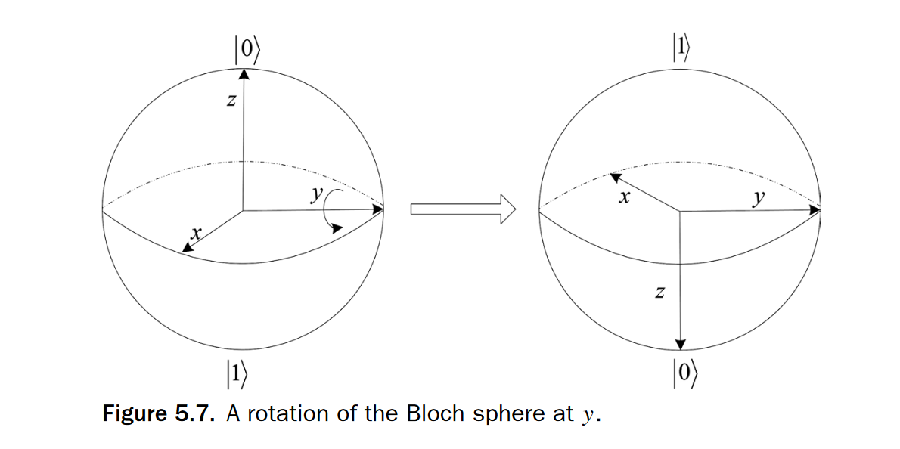

# Basic computing and quantum computing Theory

## Basic Math
Recall that the **modulus** of a complex number $a + ib$ is given by $| a + ib | = \sqrt{a^2 + b^2}$ \
and the **complex conjugate** is given by $\overline{a + ib} = a - ib$.

$| 6 + \pi i | = \sqrt{6^2 + \pi^2}; \quad \overline{6 + \pi i} = 6 - \pi i$

$$
\begin{align*}
|0\rangle = \begin{bmatrix} 1 \\ 0 \end{bmatrix}; \quad
|1\rangle = \begin{bmatrix} 0 \\ 1 \end{bmatrix}
\end{align*}
$$

**Quantum gates:**
$$
\begin{align*}
H = \frac{1}{\sqrt{2}}\begin{bmatrix} 1 & 1 \\ 1 & -1 \end{bmatrix}; \quad
T = \begin{bmatrix} 1 & 0 \\ 0 & e^{i\frac{\pi}{4}} \end{bmatrix}; \quad
S = \begin{bmatrix} 1 & 0 \\ 0 & i \end{bmatrix} = T^2
\end{align*}
$$

**Pauli matrices:**
$$
\begin{align*}
\sigma_0 \equiv I \equiv \begin{bmatrix} 1 & 0 \\ 0 & 1 \end{bmatrix} \quad
\sigma_1 \equiv \sigma_x \equiv X \equiv \begin{bmatrix} 0 & 1 \\ 1 & 0 \end{bmatrix}
\end{align*}
$$
$$
\begin{align*}
\sigma_2 \equiv \sigma_y \equiv Y \equiv \begin{bmatrix} 0 & -i \\ i & 0 \end{bmatrix} \quad
\sigma_3 \equiv \sigma_z \equiv Z \equiv \begin{bmatrix} 1 & 0 \\ 0 & -1 \end{bmatrix}
\end{align*}
$$

**Inner product:**
$$
\begin{align*}
\langle\psi|\varphi\rangle = a_0^* b_0 + a_1^* b_1
\end{align*}
$$

**Outer product:**

$$
|0 \rangle \langle 0| = \begin{bmatrix} 1 & 0 \\ 0 & 0 \end{bmatrix}, \quad
|0 \rangle \langle 1| = \begin{bmatrix} 0 & 1 \\ 0 & 0 \end{bmatrix}, \quad
|1 \rangle \langle 0| = \begin{bmatrix} 0 & 0 \\ 1 & 0 \end{bmatrix}, \quad
|1 \rangle \langle 1| = \begin{bmatrix} 0 & 0 \\ 0 & 1 \end{bmatrix}
$$

$$
\begin{align*}
|\psi\rangle\langle\varphi| = 
\begin{bmatrix}
a_0 b_0^* & a_0 b_1^* \\
a_1 b_0^* & a_1 b_1^*
\end{bmatrix}
= a_0 b_0^* |0\rangle\langle0| + a_0 b_1^* |0\rangle\langle1| + a_1 b_0^* |1\rangle\langle0| + a_1 b_1^* |1\rangle\langle1|
\end{align*}
$$

**Tensor product:**

$$
\left|\psi\right\rangle \otimes \left|\varphi\right\rangle = a_0b_0\left|00\right\rangle + a_0b_1\left|01\right\rangle + a_1b_0\left|10\right\rangle + a_1b_1\left|11\right\rangle = 
\begin{bmatrix}
a_0b_0 \\
a_0b_1 \\
a_1b_0 \\
a_1b_1
\end{bmatrix}
$$

**Basic Operations:**
$$
H |0 \rangle = |+ \rangle, \quad H |1 \rangle = |- \rangle, \quad
H |+\rangle = |0 \rangle, \quad H |-\rangle = |1 \rangle
$$
Where $|+\rangle = \frac{1}{\sqrt{2}}(|0\rangle + |1\rangle) \quad |- \rangle = \frac{1}{\sqrt{2}}(|0\rangle - |1\rangle)$.

$$
I|0\rangle = |0\rangle, \quad I|1\rangle = |1\rangle; \quad
X|0\rangle = |1\rangle, \quad X|1\rangle = |0\rangle; \newline
Y|0\rangle = i|1\rangle, \quad Y|1\rangle = -i|0\rangle; \quad
Z|0\rangle = |0\rangle, \quad Z|1\rangle = -|1\rangle
$$

## Pauli Gates and the Bloch Sphere
The Pauli gates are **Hermitian and unitary**, which means that they are self-adjoint and their inverse is equal to their conjugate transpose. The Pauli gates are also **involutory**, which means that applying the gate **twice** will return the **original state**. The Pauli gates are also **traceless**, which means that the sum of the diagonal elements is zero.
$$
\textbf{X basis:} \quad \left\{|+\rangle = \frac{|0\rangle + |1\rangle}{\sqrt{2}}, \quad |-\rangle = \frac{|0\rangle - |1\rangle}{\sqrt{2}} \right\} \\[1em]
\textbf{Y basis:} \quad \left\{|i\rangle = \frac{|0\rangle + i|1\rangle}{\sqrt{2}}, \quad |-i\rangle = \frac{|0\rangle - i|1\rangle}{\sqrt{2}} \right\} \\[1em]
\textbf{Z basis:} \quad \left\{|0\rangle, |1\rangle \right\}
$$
- the X, Y and Z basis states are **orthogonal** and **normalized**;
- the X, Y and Z basis states are **eigenstates** of the Pauli X, Y and Z gates

The X, Y, and Z Pauli matrices are ways of “flipping” the Bloch sphere 180◦ about the x, y, and z axes respectively.

