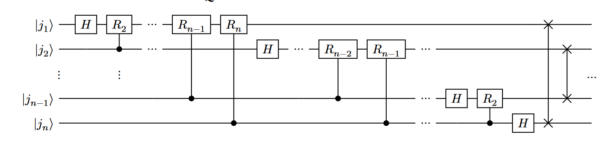

# QKD and QFT

## Quamtum Key Distribution

## Quantum Fourier Transform
$|\psi\rangle$: A normalized quantum state:
$$
\left| \psi \right\rangle = 
\begin{pmatrix}
a_0 \\
a_1 \\
a_2 \\
\vdots \\
a_{N-1}
\end{pmatrix}
= a_0 \left| 0 \right\rangle + \cdots + a_{N-1} \left| N-1 \right\rangle
$$
Applying the QFT yields another normalized quantum state:

$$
\left| \phi \right\rangle =
\begin{pmatrix}
\phi_0 \\
\phi_1 \\
\phi_2 \\
\vdots \\
\phi_{N-1}
\end{pmatrix}
= 
\phi_0 |0\rangle + \dots + \phi_{N-1}|N-1\rangle
$$
We call $|\phi\rangle$ the quantum Fourier fransform of $|\psi\rangle$. The equat   ion:

**Generic QFT circuit**
$$
\left| j \right\rangle \longrightarrow \frac{1}{\sqrt{N}} \sum_{k=0}^{N-1} e^{\frac{2\pi i jk}{N}} \left| k \right\rangle
$$

Where $R_k$:
$$
R_k = \begin{bmatrix}
1 & 0 \\
0 & e^{2\pi \frac{i}{2^k}}
\end{bmatrix}
$$

To invert the QFT, we must run the circuit in reverse, with the inverse of each gate in place to achieve the transform

**Inverse Quantum Fourier Transform**

