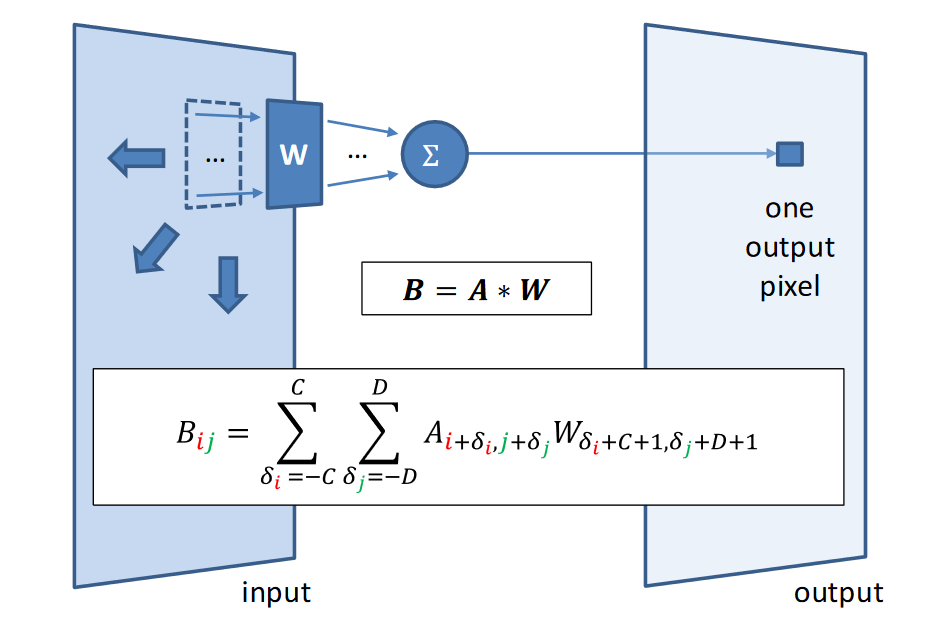
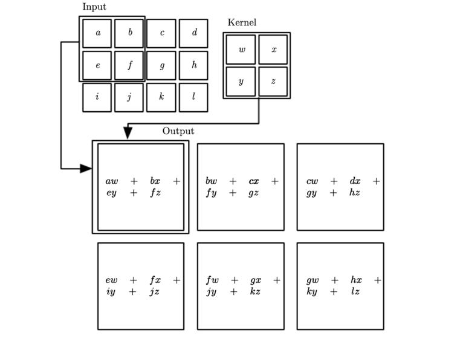
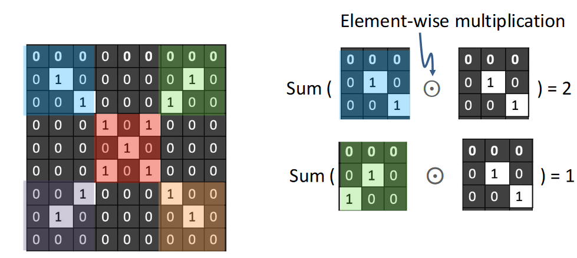

# Precepction and Artificial Neural Network

## Convolutional Neural Network

**Convolution**
Measures how the shape of one function matches the other as it **slides** along.

**Convolution on 2D images**

Using filter to perform element-wize multiplication

**Convolution filters (aka kernels)**

Filters/kernels can identify different patterns

- When input and kernel have the same patern: high activation response

**2D example**
Response map: 2D map of the presence of a pattern at different locations in an input

### Convolution parameters
Key *hyperparameters* in convolution
- Kernel size: size of the patches
- Number of filters: depth(channel) of the input
- Stride: how far to "slide" pacth across input
- Padding of input boundaries with zeros

### Components of a CNN
**Convolutional layers**
- Complex input representations based on convolution operation
- Filter weights are learned from training data

**Downsampling, usually via Max Pooling**
- Re-scales to smaller resolution, limits parameter explosion

**Fully connected parts and output layer**
- Merges representations together

**Downsampling via max pooling (re)**

Max pooling helps reduce the spatial dimensions (height and width) of the feature maps while keeping the most important information.

