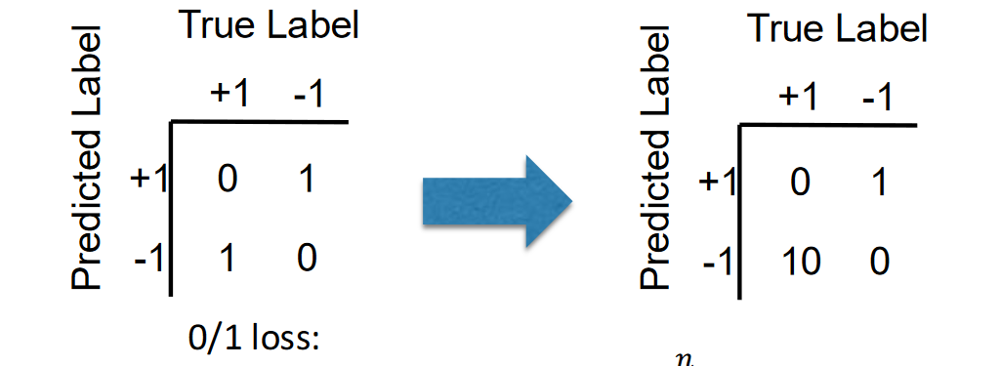
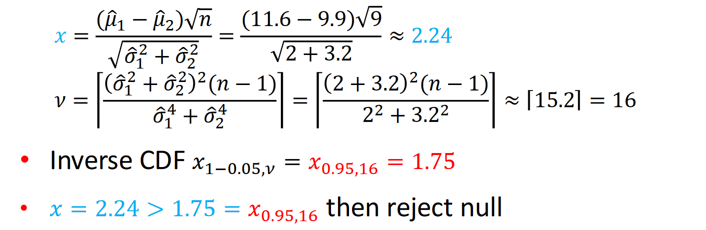

#   

## Cross validation
Compare different algorithms in terms of performance from limited available data and help choose hyperparameters for an algorithm

**Performance matrices**
- Given a dataset $D = \{x_1, y_1, \ldots, x_n, y_n \}$ of n samples.
- For a data point $x_i$ we predict $g(x_i)$

Matrices in **regression**
- Mean squared error: $MSE(g) = \frac{1}{n} \sum_{i = 1}^{n}(g(x_i)-y_i)^2$
- Root mean squared error: $RMSE(g) = \sqrt{MSE(g)}$
- Mean absolute error: $\frac{1}{n}\sum_{i=1}^{n} |g(x_i)-y_i|$

Performance metrics in **classification**

|                | True Label +1 | True Label -1 |
|----------------|---------------|---------------|
| Predicted +1   | TP            | FP            |
| Predicted -1   | FN            | TN            |

- Accurcy: (𝑇𝑃 + 𝑇𝑁) / (𝑇𝑃 + 𝐹𝑃 + 𝐹𝑁 + 𝑇𝑁)
- Error: (𝐹𝑃 + 𝐹𝑁)/(𝑇𝑃 + 𝐹𝑃 + 𝐹𝑁 + 𝑇𝑁)
- Recall/Sensitivity: 𝑇𝑃/(𝑇𝑃 + 𝐹𝑁)
- Precision 𝑇𝑃/(𝑇𝑃 + 𝐹𝑃)
- Specificity 𝑇𝑁/(𝑇𝑁 + 𝐹𝑃)
- F1-score: 2 𝑃𝑟𝑒𝑐𝑖𝑠𝑖𝑜𝑛 × 𝑅𝑒𝑐𝑎𝑙𝑙/(𝑃𝑟𝑒𝑐𝑖𝑠𝑖𝑜𝑛 + 𝑅𝑒𝑐𝑎𝑙𝑙)

**Receiver Operating Characteristic (ROC)**

Summarized with an Area Under the Curve (AUC):
- Random: 0.5
- Perfect Classifier: 1

**Modified loss function**

Different misclassification have difference influence

Predicting a diseased patient as healthy has much worse serious consequences than predicting a diseased patient as healthy!!!

**Cross-validation: using “unseen” data**

Split datasets in three parts

| Training Set    | Validation Set         | Test Set     | 
|----------------|---------------|---------------|

**K-Fold Cross Validation**
- Split training data $D$ into $k$ **disjoint** sets $S_1, \ldots, S_k$
    - Either randomly, or in a fixed fashion
    - If $D$ has $n$ samples, then each fold has approximately $\frac{n}{k}$ samples
    - Popular choices: $k = 5, k = 10, k = n$ (leave one out)
- For $i = 1 \ldots k$
    - train with sets $S_1, \ldots, S_{i-1}, S_{i+1},\ldots, S_k$
    - test on set $S_i$
    - let $M_i$ be the test metric (e.g., accuracy, MSE)

Mean $\hat{u} = \sum_{i = 1}^{k}\quad$ variance $\hat{\sigma}^2 = \sum_{i = 1}^{k} (M_i - \hat{u})^2$

**0.632 Bootstrapping**

Let $B > 0$, and $n$ be the number of training samples in $D$

- For $i = 1 \ldots B $ :
    - Pick n samples from $D$ with **replacment**, call it $S_i$ ($S_i$ might contain the same sample more than once)
    - train with set $S_i$
    - test on the remaining samples $(D - S_i)$
    - let $M_i$ be the test metric (e.g., accuracy, MSE)

Mean $\hat{u} = \sum_{i = 1}^{B} M_i \quad$ variance $\hat{\sigma}^2 = \sum_{i = 1}^{k} (M_i - \hat{u})^2$

- not picking one particular item in 1 draw is 1 − 1/𝑛
- not picking one particular item in 𝑛 draws is $(1 − 1/𝑛)^2$  
- picking one particular item in 𝑛 draws is $1- (1 − 1/𝑛)^2$  

Finally: $\lim_{n\to\infty} 1-(1-1/n)^n = 1-1/e \approx 0.632$

**Nested Cross-valdation**
- Useful for hyperparameter tuning
- Inner cross-vaildation (e.g., 0.632 bootstapping) to try different hypermarameters
- Outer cross-validation (e.g., k-folds) to report metric using the best hyptermenter   

**Hypothesis testing**
- Let $\hat{u_1},\hat{u_2},\hat{\sigma_1}^2,\hat{\sigma_2}^2$ be mean and variance of algorithms 1 and 2

$$
\text{Let} \, x = \frac{(\hat{\mu}_1-\hat{\mu}_2)\sqrt{n}}{\sqrt{\hat{\sigma}_1^2+\hat{\sigma}_2^2}} \qquad \nu = \left\lfloor\frac{(\hat{\sigma}_1^2+\hat{\sigma}_2^2)^2(n-1)}{\hat{\sigma}_1^4+\hat{\sigma}_2^4}\right\rfloor

$$
v using **upper bound**, degrees of freedom of Student's t-distribution

Examples

## Learning with expert advice

## MAB

