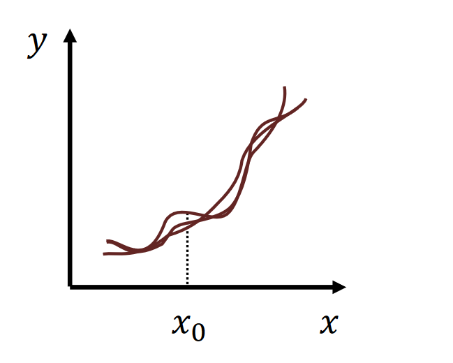
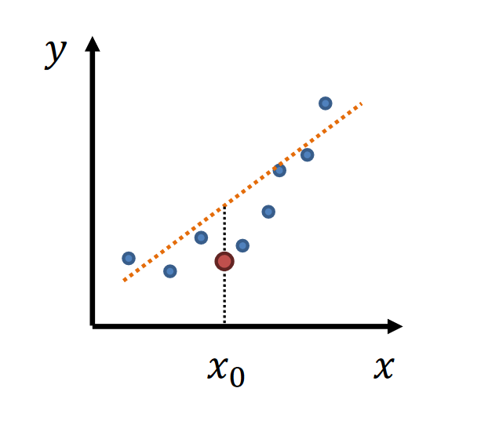
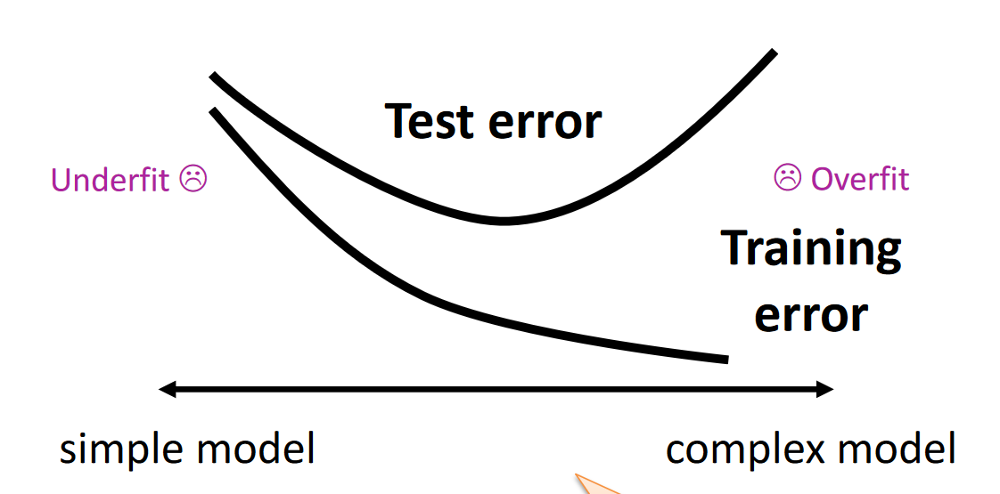

## Bias-variance trade-off
- **simple** model $\rightarrow$ low variance, high bias
- **complex** model $\rightarrow$ high variance, low bias

|  |  |
|:--------------------------:|:--------------------------:|
| high variance | high bias |

**Testing and trainning error**
    

## Empirical Risk and True Risk
**The true risk** is the expected value of the loss 𝑙

$$
R[f] = \mathbb{E}[l(Y, f(X))] = \int l(Y, f(X)) P(X, Y) dX dY
$$
- $l(Y, f(X))$: Loss function
- $P(X,y)$ joint distribution of input X and target Y

The **empirical risk** is an estimate (an average of a finite number of samples 𝑛) of the expected value
- sample size $\rightarrow \infty $, the true risk is the empirical risk

**Structural Risk Minimisation**

$$
\hat{R}_D[\hat{f}_D] + \sqrt{\frac{\log |\mathcal{F}| + \log(1/\delta)}{2n}}
$$

## VC dimension
